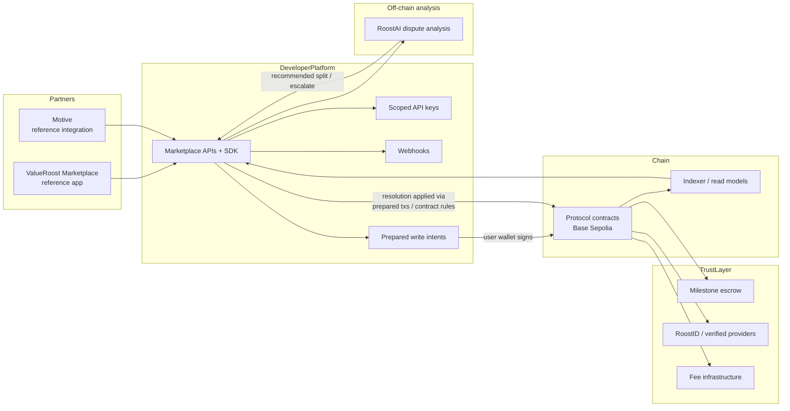

# ValueRoost — Trust Infrastructure for Service Marketplaces

ValueRoost provides reusable trust and settlement infrastructure for service marketplaces and software platforms.

Partners keep their brand, users, and UX. ValueRoost supplies the programmable escrow, stablecoin settlement, portable reputation, dispute analysis, and marketplace APIs underneath.

> **Public overview only.** Production source is not included. See [NOTICE.md](./NOTICE.md).

---

## What ValueRoost covers

| Capability | Role |
|------------|------|
| **Programmable milestone escrow** | Per-job on-chain escrow with fund / deliver / approve / release flows |
| **Stablecoin settlement** | USDC-denominated settlement (mock USDC on testnet today) |
| **Marketplace APIs** | Marketplace-scoped jobs, bids, webhooks, and read models |
| **Developer SDK** | Typed client helpers for partner backends and apps (`@valueroost/sdk`) |
| **Marketplace-scoped API keys** | `vr_test_` / `vr_live_` keys bound to a marketplace |
| **Webhooks** | Signed event delivery for job and bid lifecycle events |
| **Prepared transaction write intents** | API prepares unsigned calldata; the user wallet signs |
| **Marketplace attribution authorization** | Partner jobs attribute to the correct marketplace via signed authorization |
| **RoostID portable reputation** | Wallet-linked identity and cross-marketplace trust signals |
| **Verified provider network** | KYC-verified freelancers recognized across the protocol |
| **RoostAI dispute analysis** | Multi-model dispute triage with human escalation |
| **Marketplace fee infrastructure** | Platform and per-marketplace fee share configuration |
| **Chat / files / notifications** | Job-scoped collaboration and event surfaces around escrow |

---

## Deployment status (accurate)

| Item | Status |
|------|--------|
| **Network** | **Base Sepolia** (current) |
| **Mainnet** | **Not launched** |
| **Testnet settlement** | **Mock USDC** |
| **Mainnet settlement (planned)** | Real **Circle USDC** |
| **Cross-chain (planned)** | **CCTP** |

---

## Architecture (high level)

**Non-custodial write path:** ValueRoost prepares unsigned transactions. User wallets sign. Contracts execute escrow. RoostAI is an **off-chain** analysis layer that advises the dispute workflow; smart contracts remain authoritative for escrow state and fund movement. The indexer exposes confirmed state to APIs and UIs.

---

## Reference implementations

### ValueRoost Marketplace

The first-party marketplace app is the **reference implementation** of the full product surface: browse/post jobs, milestone escrow, bidding, RoostID verification, disputes, reviews, chat, and notifications. It dogfoods the same infrastructure partners integrate against.

### Motive

**Motive** is our **reference / test partner integration**. It is **not** an external paying customer. It exercises the headless path: marketplace-scoped API keys, SDK job listing, prepared transactions, and wallet signing—without direct diamond access from the partner UI.

Screenshots: [screenshots/valueroost/](./screenshots/valueroost/) · [screenshots/developer-portal/](./screenshots/developer-portal/) · [screenshots/motive/](./screenshots/motive/) · [captions](./screenshots/captions.md)

---

## Developer flow

1. **Register a marketplace** (owner wallet + marketplace configuration).
2. **Create API credentials** (`vr_test_` / `vr_live_`, bound to that marketplace).
3. **Create and read jobs** via marketplace-scoped APIs.
4. **Subscribe to webhooks** for lifecycle events.
5. **Prepare transactions** (write intents) for post / bid / fund / deliver / approve.
6. **User signs** in their wallet.
7. **Contracts execute escrow** on-chain.
8. **Indexer exposes state** back through APIs and partner UIs.

See [docs/developer-integration.md](./docs/developer-integration.md) and [examples/basic-integration/](./examples/basic-integration/).

---

## Live Developer Platform

ValueRoost includes a developer platform for marketplace and software integrations, including API documentation, SDK guidance, marketplace configuration, webhooks, prepared transactions, and a Base Sepolia sandbox workflow.

**Developer Portal & Documentation:** [INSERT LIVE DOCS URL]

The documentation in this repository provides a public technical overview. The live Developer Platform contains the current integration experience and developer-facing documentation.

## Documentation

| Doc | Topic |
|-----|--------|
| [docs/architecture.md](./docs/architecture.md) | Platform layers and trust boundaries |
| [docs/marketplace-infrastructure.md](./docs/marketplace-infrastructure.md) | MIaaS product map |
| [docs/escrow-lifecycle.md](./docs/escrow-lifecycle.md) | Job → milestone → release / dispute |
| [docs/developer-integration.md](./docs/developer-integration.md) | APIs, keys, webhooks, prepared txs |
| [docs/roostid.md](./docs/roostid.md) | Portable identity and reputation |
| [docs/roostai.md](./docs/roostai.md) | Dispute analysis layers |
| [docs/security.md](./docs/security.md) | High-level security posture |

---

## Security (high level)

ValueRoost emphasizes contract testing, upgrade/layout testing, escrow invariants, marketplace attribution authorization, and replay protection. Details suitable for public overview are in [docs/security.md](./docs/security.md). This repository does **not** publish attack reproductions or internal audit exploit narratives.

---

## What this repo is not

- Not production source
- Not deployable contracts or backend services
- Not a secret or key store
- Not a substitute for partner onboarding docs once live credentials are issued

---

## License / notice

See [NOTICE.md](./NOTICE.md).
