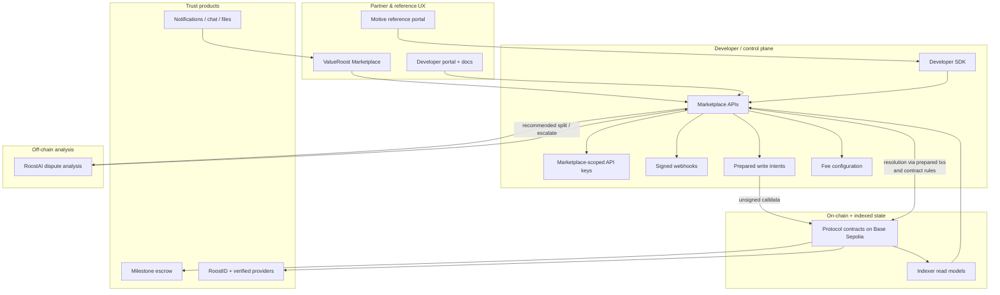

# Architecture

High-level view of ValueRoost as trust and settlement infrastructure for service marketplaces.

## Positioning

ValueRoost is **infrastructure**, not a single vertical marketplace product. Partner marketplaces own branding, customer relationships, and UX. ValueRoost owns escrow settlement rules, portable professional identity (RoostID), reputation signals, dispute analysis (RoostAI), and the developer surface that binds them together.

The **ValueRoost Marketplace** app is the reference implementation. **Motive** is a reference/test headless integration—not an external paying customer.

## Layer diagram

## Trust boundaries

| Boundary | Responsibility |
|----------|----------------|
| Partner application | UX, user sessions, when to call APIs |
| ValueRoost API / SDK | Auth, marketplace scoping, prepare read/write orchestration, webhooks |
| User wallet | Signs transactions; holds keys |
| Protocol contracts | Escrow custody rules, milestone state, attribution checks |
| Indexer | Confirmed-state projections for API/UI reads |
| Off-chain services | KYC review, chat/files, RoostAI evidence analysis (no unilateral fund movement) |

**Important:** ValueRoost prepares write intents; it does not unilaterally move escrow. Funds move only through contract rules after valid signatures and state transitions.

## Marketplace scoping

Every job, bid, fee share, and webhook delivery is associated with a **marketplace id**. API keys are bound to a marketplace. Partner write paths that attribute work to a non-native marketplace use **marketplace attribution authorization** so escrow and discovery remain correctly scoped.

## Settlement today vs planned

| Concern | Current | Planned |
|---------|---------|---------|
| Chain | Base Sepolia | Base mainnet (not launched) |
| Settlement asset | Mock USDC | Circle USDC |
| Cross-chain | Not in production | CCTP |

## Related docs

- [marketplace-infrastructure.md](./marketplace-infrastructure.md)
- [escrow-lifecycle.md](./escrow-lifecycle.md)
- [developer-integration.md](./developer-integration.md)
- [security.md](./security.md)
