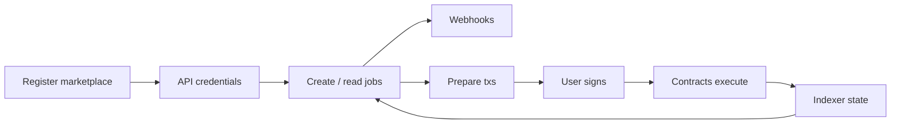

# Developer Integration

Public overview of how partner marketplaces integrate with ValueRoost. No production source or live secrets are included.

**Environment:** Base Sepolia sandbox. Testnet settlement uses mock USDC. Mainnet is not launched.

## Prerequisites

- Owner wallet for marketplace registration
- Marketplace-scoped API credentials (`vr_test_` for sandbox; `vr_live_` when production is available)
- Ability for end users to connect a wallet and sign transactions
- Optional: webhook HTTPS endpoint for signed events

## End-to-end flow

```text
1. Register marketplace
2. Create API credentials (bound to marketplace id)
3. Create / read jobs (marketplace-scoped)
4. Subscribe to webhooks
5. Prepare transactions (write intents)
6. User wallet signs
7. Contracts execute escrow
8. Indexer exposes confirmed state via APIs
```



## Authentication (conceptual)

Server-side calls use a **Bearer** marketplace-scoped secret key. Keys must stay on the server—never ship secret keys in browser or mobile bundles.

Optional marketplace header may be supplied when documenting multi-tenant tooling; the key itself is already bound to one marketplace.

Publishable vs secret key roles exist so browser-safe surfaces can be separated from privileged server operations.

## Core surfaces

| Surface | Purpose |
|---------|---------|
| Marketplaces | Read configuration / capabilities for the bound marketplace |
| Jobs | List and fetch marketplace-scoped jobs |
| Bids | Read bid state for jobs |
| Webhooks | Register endpoints; receive signed lifecycle events |
| Write intents | Prepare unsigned calldata for post, bid, award, fund, deliver, approve, etc. |
| Reputation / identity reads | Wallet trust signals via RoostID surfaces |

Exact paths and payloads are documented in the live developer portal when onboarding; this overview stays conceptual.

## Prepared transactions

ValueRoost **prepares** unsigned transactions. The partner app presents them to the user wallet. After confirmation, the indexer updates read models.

This keeps partners off privileged contract admin paths and preserves non-custodial signing.

## Webhooks

Partners subscribe to events such as job posted and bid placed. Deliveries are **signed** so receivers can verify authenticity and apply **replay protection** practices (see [security.md](./security.md)).

## SDK

The `@valueroost/sdk` package provides a typed client for partner backends/apps: API calls, sending prepared transactions through a wallet connector, and verifying webhook signatures.

## Reference integrations

| Implementation | Pattern |
|----------------|---------|
| ValueRoost Marketplace | First-party full UX on the same APIs/contracts |
| Motive | Headless reference/test portal: API key + SDK + wallet sign only |

Motive is **not** an external paying customer; it validates the partner path.

## Example outline

See [../examples/basic-integration/README.md](../examples/basic-integration/README.md).

## Related docs

- [architecture.md](./architecture.md)
- [escrow-lifecycle.md](./escrow-lifecycle.md)
- [security.md](./security.md)
