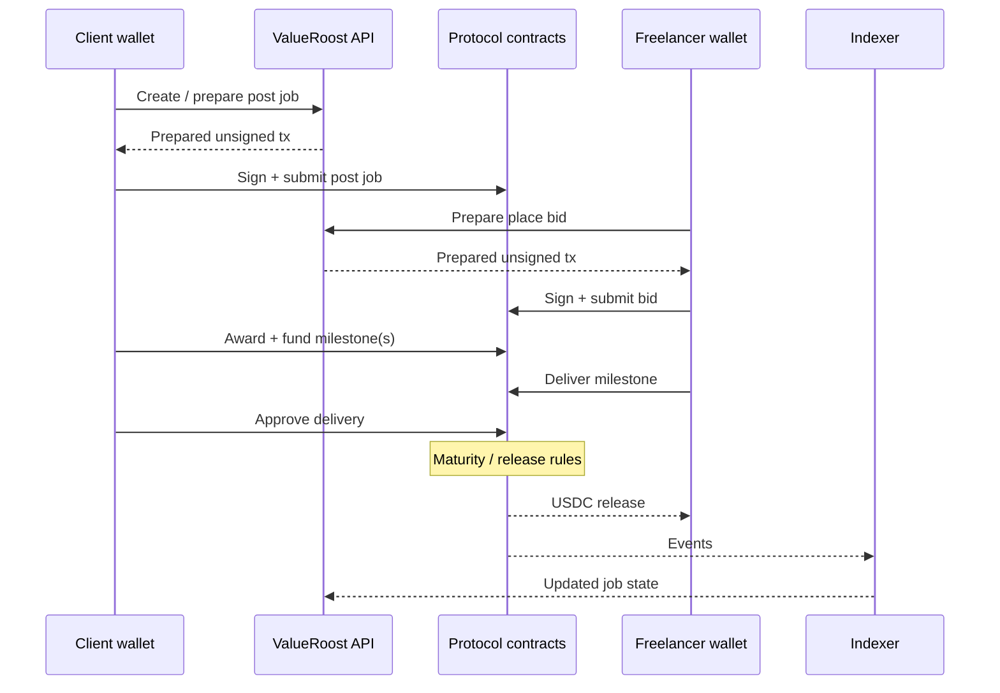

# Escrow Lifecycle

Programmable milestone escrow is the core settlement primitive. Each job is associated with on-chain escrow that holds funds until delivery rules are satisfied—or until a dispute resolves a split.

Settlement today is **mock USDC on Base Sepolia**. Mainnet Circle USDC is planned; mainnet is not launched.

## Happy path

## Stages (conceptual)

1. **Post job** — Client posts a marketplace-scoped job (budget, skills, deadlines, privacy).
2. **Bid** — Verified providers bid; bids can be edited or withdrawn per product rules.
3. **Award** — Client selects a freelancer; work begins under escrow rules.
4. **Fund milestone** — Client funds a milestone; funds lock in the job escrow.
5. **Deliver** — Freelancer submits delivery for that milestone.
6. **Approve / revise** — Client approves, or requests revision within allowed limits.
7. **Release** — After approval (and any maturity window), funds release to the provider; marketplace fee share applies per configuration.
8. **Auto-release path** — If the client does not respond within the configured window, release rules allow the freelancer to claim after maturity.
9. **Dispute path** — Either party can raise a dispute on a milestone; funds freeze until resolution (see [roostai.md](./roostai.md)).

## What escrow guarantees (high level)

- Funds for a milestone are not unilaterally withdrawable by client, freelancer, or ValueRoost outside the contract rules.
- Delivery and approval are explicit state transitions.
- Disputes freeze the disputed milestone.
- Settlement is stablecoin-denominated (USDC unit of account).

## Marketplace attribution

Jobs created through partner marketplaces carry marketplace attribution so fee share, discovery, and indexing stay scoped correctly. Attribution authorization is part of the public security posture described in [security.md](./security.md).

## Related docs

- [architecture.md](./architecture.md)
- [roostai.md](./roostai.md)
- [developer-integration.md](./developer-integration.md)
