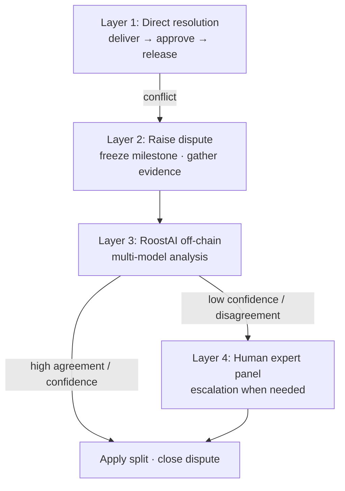

# RoostAI

RoostAI is ValueRoost’s dispute analysis layer for milestone escrow. It helps resolve delivery disagreements without giving any party unilateral control of locked funds.

## Why it exists

When client and provider disagree on whether work meets the brief, traditional marketplaces rely solely on slow human support. RoostAI is a **triage system**: clear cases can be analyzed quickly; ambiguous cases escalate to humans.

Escrow for the disputed milestone **freezes** until resolution. Neither party—nor ValueRoost—can quietly withdraw during review.

## Four layers (conceptual)

### Layer 1 — Direct resolution

Most milestones never dispute. Freelancer delivers → client approves → funds release per escrow rules.

### Layer 2 — Raise a dispute

Either party raises a dispute on a milestone. Funds freeze. Both sides submit evidence within a bounded window (brief, deliveries, chat excerpts, screenshots, revision history).

### Layer 3 — RoostAI verdict (off-chain)

RoostAI runs **off-chain**. Multiple independent models receive the same structured case materials and produce recommended splits, reasoning, and confidence. Close agreement with high confidence can auto-apply via the dispute workflow; disagreement or low confidence escalates. Smart contracts remain authoritative for escrow state and fund movement.

### Layer 4 — Human expert arbitration

A vetted expert panel reviews the same evidence and votes within a fixed window. Escalation may carry a fee structure designed to discourage frivolous appeals (details are product configuration, not published here as operational secrets).

## Design principles (public)

- **Multi-model, not single-oracle** — reduces single-model blind spots
- **Confidence-based escalation** — AI does not pretend to resolve every case
- **Funds frozen on dispute** — no race to withdraw
- **Auditable outcomes** — resolution and fund movement follow on-chain rules
- **Not “AI with no accountability”** — humans remain the backstop for hard cases

## Related docs

- [escrow-lifecycle.md](./escrow-lifecycle.md)
- [security.md](./security.md)
- Screenshot: [../screenshots/valueroost/disputes.png](../screenshots/valueroost/disputes.png)
